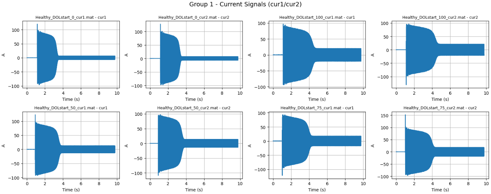
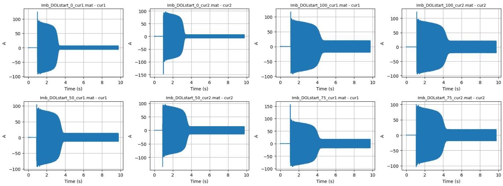
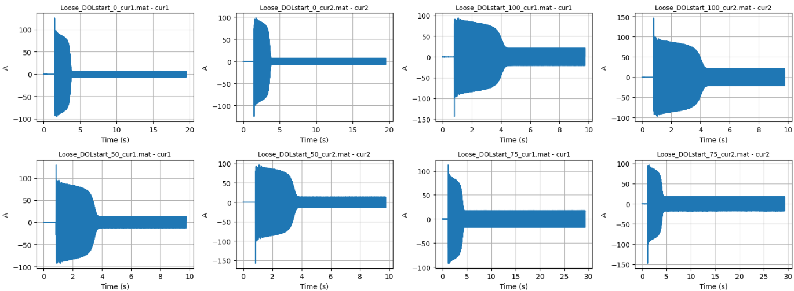
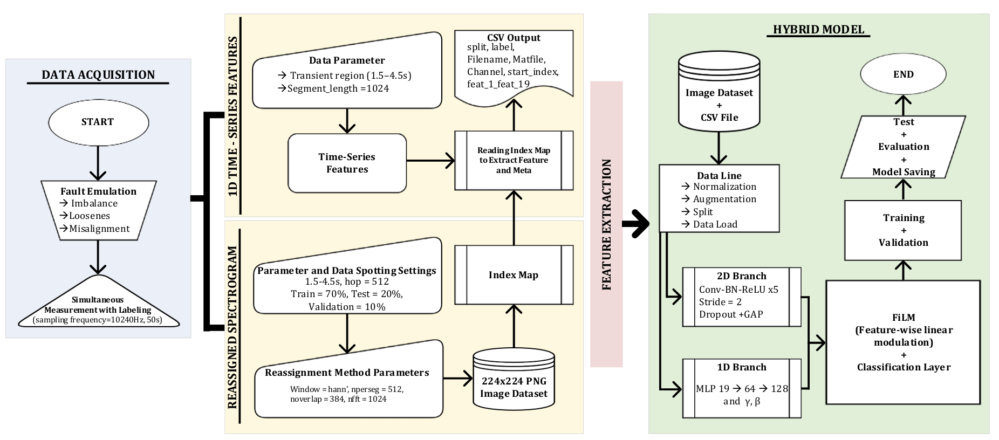
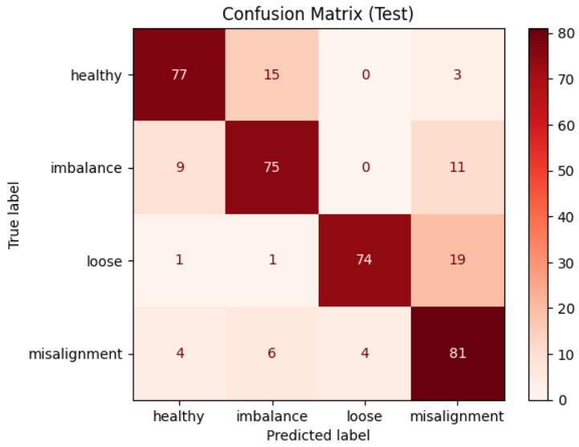
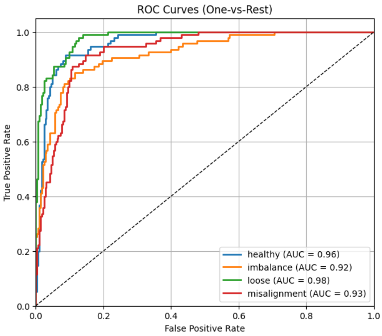
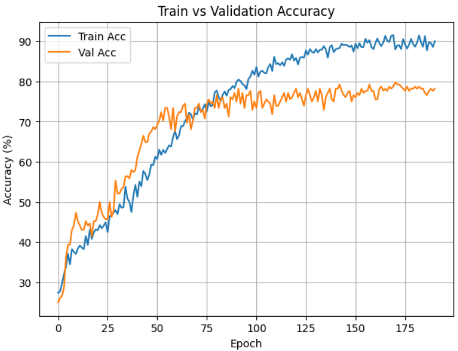

# Motor Fault Hybrid Model (1D + 2D FiLM Fusion)

Hybrid fault detection and classification for induction motors using **start-up stator current**:
- **1D statistical features (19 features)** + **2D high-resolution reassigned spectrogram (RS) images**
- Fusion via **FiLM (Feature-wise Linear Modulation)**

This repository is the codebase of our ELECO 2025 paper:
**“A Hybrid Machine Learning Model based on Start-Up Stator Current and High-Resolution Time-Frequency Images for Mechanical Fault Detection and Classification in Induction Motors.”** 

> “The hybrid model reaches 80.8% classification accuracy, outperforming single-modality CNNs.” 

---

## Highlights
- Uses **start-up transient** signals (not steady-state) for fast diagnosis. 
- Builds a 2D dataset using **STFT-based reassigned spectrograms**, stored as **224×224 RGB PNG**. 
- Extracts **19 time-domain statistical features** per segment and maps them **1-to-1** to each RS image via an index map (filename + start index).   
- FiLM conditions the CNN feature maps using 1D features with sample-dependent (γ, β) modulation. 

---

## Fault Classes
- `healthy`
- `imbalance`
- `looseness`
- `misalignment` 

---

## Pipeline Summary
### 1) Reassigned Spectrogram (RS) Dataset
- Sampling frequency: **10.24 kHz**
- Transient region: **1.5–4.5 s**
- Segmentation: **L=1024**, **H=512** (hop)
- RS/STFT params: `window=hann`, `nperseg=512`, `noverlap=384`, `nfft=1024`
- Convert to dB, crop frequency to **0–2 kHz**, save as **224×224 RGB PNG** 

### 2) 1D Feature Extraction
- Extract **19 statistical features** (RMS, peak, peak-to-peak, skewness, kurtosis, crest/impulse/clearance/shape factors, etc.)
- Use the **same segment identifiers** from the RS index map to ensure **one-to-one correspondence** and reduce leakage risk.

### 3) Hybrid Model (FiLM Fusion)
- 2D branch: 5 × Conv–BN–ReLU blocks (stride=2) + GAP → 256-d embedding
- 1D branch: MLP 19→64→128 → produces FiLM coefficients (γ, β)
- FiLM modulation applied channel-wise (after BN, before ReLU) in late CNN stages
- Training: Adam optimizer + cosine annealing + label smoothing + dropout + gradient clipping + light L2 on 1D branch 

---

## Results (Test Set)
- **Accuracy:** 80.8%
- **Macro-F1:** 0.81
- **AUC range:** 0.92–0.98 (OvR ROC-AUC) 
Per-class (Precision / Recall / F1):
- Healthy: 0.85 / 0.81 / 0.83
- Imbalance: 0.77 / 0.79 / 0.78
- Looseness: 0.95 / 0.78 / 0.86
- Misalignment: 0.71 / 0.85 / 0.78 

Model comparison (same dataset):
- Hybrid: 80.8%
- ResNet-18: 34.2%
- EfficientNet-B0: 27.6%
- MobileNetV2: 58.1%
- Simple-CNN: 39.2%
- Residual-CNN: 54.7%

---

## Results Gallery

## Data Visualizations
## Healthy Induction Motor Start-up Current Data

## Imbalance Induction Motor Start-up Current Data

## Looseness Induction Motor Start-up Current Data

## Misalignment Induction Motor Start-up Current Data

## STFT-based Reassigned Spectrograms of Start-up Stator Current Signals

### Pipeline Overview 

### Evaluation Visualizations

---

## Data Note (Ethics)
Raw current measurements are not included in this repository. The paper notes that the source measurements are available via Korea University’s public database; please follow the link provided in the paper appendix. 

---

## References
-> F. Auger, P. Flandrin, “Improving readability of time-frequency and time scale representations by reassignment,” IEEE TSP, 1995.
-> E. Perez et al., “FiLM: Visual reasoning with a general conditioning layer,” ICLR, 2018.
-> M. Sun et al., “A novel data-driven mechanical fault diagnosis method for induction motors using stator current signals,” IEEE TTE, 2023.
-> J. Wang et al., “A light weight multisensory fusion model for induction motor fault diagnosis,” IEEE/ASME TMech, 2023.
